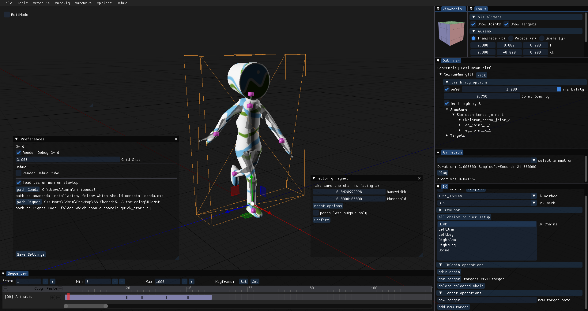
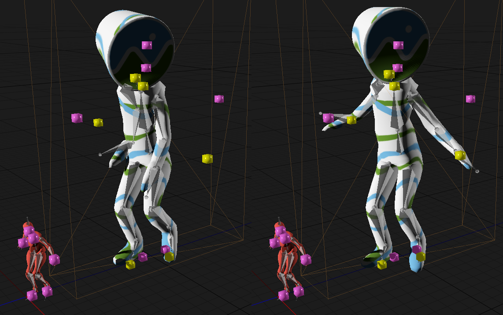

<h3 align="center">
Implementation of a modular pipeline to
evaluate different rigging and retargeting
techniques for virtual humans using
CrossForge
</h3>

This repository contains the submitted version of my Bachelor's thesis. (main.pdf)

This work is currently under review by supervisors and has not yet been defended.

Abstract:

```
The objective of this thesis was to implement a modular framework that facilitates
the integration of diverse rigging and retargeting methodologies, thereby enabling
a comparative analysis of their quality and performance. The primary goal was to
create a tool that automates or streamlines the process of creating a virtual character
just from a scan. Therefore the open-source 3D framework CrossForge, developed
at the GDV professorship, served as the basis for this work. As a result, a modular
processing pipeline was created, incorporating a versatile application programming
interface (API) that enables the integration and evaluation of diverse algorithmic
implementations and thereby streamlining the efficient creation of prototypes. Fur-
thermore, a sophisticated user interface has been developed that provides other re-
searchers with the opportunity to easily integrate further skinning and retargeting
methods. Thus, the implemented modules facilitate the comparison, and combina-
tion of various retargeting algorithms, as well as the evaluation of their correctness
including potential advantages and drawbacks.
```

<p align="center">
  
</p>

The presented thesis employs a highly adaptable kinematic chain-based retargeting approach built from the ground up.
This approach involves retargeting motion data on a per chain basis,
followed by choosing different inverse kinematics solvers for motion cleanup on the same armature.

<p align="center">
  
</p>

The accompanying code is contained in the CrossForge folder. Place "imgui.ini" in the executable folder for the presented window layout.

It should be noted that not all features presented have been implemented.
For a more up-to-date version of the code, please visit https://github.com/nSkade/CrossForge/tree/dev_MoRe.
